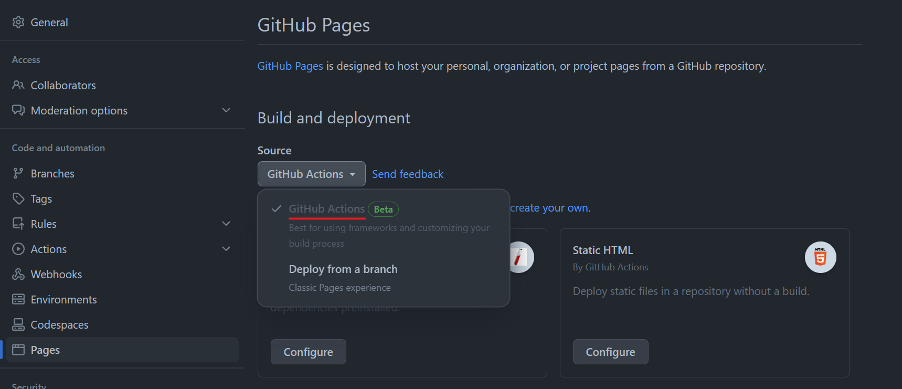

# How it works

The idea is to use VuePress to build a documentation site for your GitHub project and host it on GitHub Pages.

The classic GitHub pages experience is to store the files for your site in the `gh-pages` branch, but that won't let us change code and documentation together in atomic commits.

Instead we will do the following:

- Store source files for the site in the main branch under `/docs`
- The `gh-pages.yml` workflow builds and deploys the docs on pushes to _main_

Your repository must be configured to use GitHub Actions as the source of your pages.

## Local development

Run `npm install` in the root directory and then `npm start` to launch a development version of VuePress.
