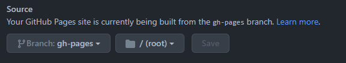

# How it works

Documentation source files are stored in the main branch under `/docs`. Change code and documentation together in atomic commits.

Your repository must be configured to use the _gh-pages_ branch and the root directory (/).

Run `npm install` in the root directory and then `npm start` to launch a development version of VuePress.

You can commit your docs as often as you like, your site won't be updated until you push changes to the `gh-pages` branch.
When you are ready to publish changes, run `./publish.sh`. You should configure a GitHub Action to do this automatically when commits are pushed to the main branch.

[🔙 GitHub](https://github.com/sliekens/vuepress-my-way)